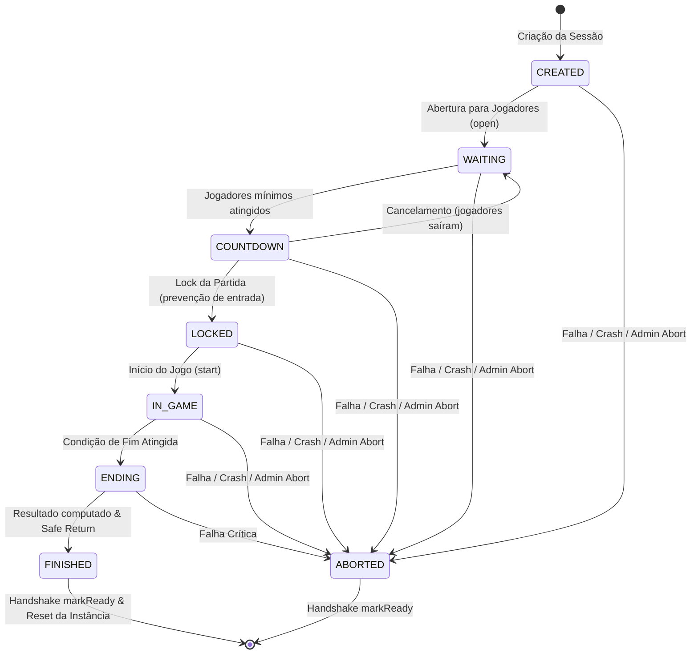

# Ciclo de Vida de Partidas (BigBangHub 0.3.0)

O BigBangHub 0.3.0 padroniza o ciclo de vida completo de partidas em toda a rede BigBangCraft. Ele define o contrato entre o proxy Velocity (orquestrador global de partidas e admissões) e as instâncias Paper (executores de minigames).

---

## 1. Máquina de Estados da Partida (`MatchState`)

### Estados Detalhados

| Estado | Descrição | Aceita Admissão? | Próximos Estados Permitidos |
|---|---|:---:|---|
| `CREATED` | Sessão instanciada no backend; gerando arena/mundo | Não | `WAITING`, `ABORTED` |
| `WAITING` | Aberta para matchmaking e admissão de jogadores | Sim | `COUNTDOWN`, `ABORTED` |
| `COUNTDOWN` | Contagem regressiva ativa para o início | Sim | `LOCKED`, `WAITING`, `ABORTED` |
| `LOCKED` | Partida travada; novas admissões bloqueadas | Não | `IN_GAME`, `ABORTED` |
| `IN_GAME` | Partida em andamento; mecânicas de gameplay ativas | Se late-join | `ENDING`, `ABORTED` |
| `ENDING` | Partida finalizada; exibição de pódio/estatísticas | Não | `FINISHED`, `ABORTED` |
| `FINISHED` | Estado terminal; jogadores retornados ao Hub | Não | *(Terminal)* |
| `ABORTED` | Estado terminal por erro, crash ou abort forçado | Não | *(Terminal)* |

---

## 2. Monotonic Revisions e Proteção CAS

Toda alteração de estado no `MatchStateMachine` incrementa uma revisão monotônica (`revision`).
Ao solicitar transições entre backend e proxy via `MATCH_STATE_CHANGE`, o pacote carrega a revisão esperada. Transições concorrentes ou pacotes fora de ordem são rejeitados com `STALE_REVISION`.

---

## 3. Tickets de Admissão e Segurança de Entrada

Para impedir que jogadores acessem minigames por conexão direta ou bypass (`/server`):

1. **Emissão de Ticket**: Quando a fila do Velocity roteia um jogador para uma partida, um `AdmissionTicket` é emitido com:
   - `ticketId` (UUID)
   - `playerId` (UUID do jogador)
   - `matchId` (ID único da partida)
   - `instanceId` (Servidor alvo)
   - `token` (Token criptográfico pseudo-aleatório)
   - `role` (`PLAYER` ou `SPECTATOR`)
   - `expiresAt` (Instant com TTL padrão de 10s)
2. **Consumo no Backend**: Ao conectar no backend, a instância Paper envia um `ADMISSION_REQUEST` ao Velocity.
3. **Validação**: O Velocity verifica:
   - Se o ticket existe e não expirou.
   - Se o jogador, instância e partida correspondem exatamente.
   - Se o ticket já foi consumido (prevenção contra ataques de replay).
   - Se a partida não está cheia ou travada.
4. **Política de Entrada Direta (`DIRECT_JOIN_REJECTED`)**: Se um jogador entrar sem ticket válido, a admissão é rejeitada e o jogador é imediatamente reconduzido em segurança para o Hub (`hubminigame`), sem kick ou banimento punitivo.

---

## 4. Ciclo de Vida do Participante (`MatchParticipant`)

### Papéis (`ParticipantRole`)
- `PLAYER`: Participante ativo disputando a partida.
- `SPECTATOR`: Espectador (direto ou após eliminação).

### Estados (`ParticipantState`)
- `RESERVED`: Vaga reservada na partida via fila.
- `ADMITTED`: Ticket consumido e confirmado pela instância.
- `ACTIVE`: Jogador spawnado na partida participando do jogo.
- `ELIMINATED`: Jogador eliminado do minigame.
- `SPECTATING`: Jogador assistindo a partida.
- `LEAVING`: Em processo de desconexão ou retorno ao Hub.
- `LEFT`: Saiu da partida.
- `DISCONNECTED`: Desconectou-se da rede durante o jogo.

---

## 5. Invariante de Sessão de Jogador

> **Regra Fundamental**: Um jogador pode pertencer a no máximo **uma partida ativa** em toda a rede.

Se um jogador tentar ingressar em uma segunda partida enquanto ainda estiver registrado como participante ativo em outra, o registro de partidas rejeita a admissão com `ErrorCode.PLAYER_ALREADY_ASSIGNED`.
A vaga só é liberada quando o jogador deixa formalmente a partida anterior, é eliminado/retornado, ou o match termina.

---

## 6. Handshake de Limpeza de Instância (`markInstanceReady`)

Quando uma partida atinge `FINISHED` ou `ABORTED`:
1. Os jogadores são retornados ao Hub via `safeReturnPlayerToHub`.
2. A instância **não** é liberada imediatamente para novas partidas.
3. O backend executa sua rotina de limpeza (reset de arena, restauração de blocos, descarga de mundos).
4. O backend chama `match.markReady()`, enviando `INSTANCE_READY` ao Velocity.
5. Somente após receber `INSTANCE_READY`, o proxy desassocia a instância da partida finalizada e a torna disponível para novas partidas.

---

## 7. Tolerância a Falhas e Recuperação

- **Timeout de Heartbeat / Crash de Instância**: Se uma instância ficar inativa ou cair durante uma partida, o sweep de liveness do Velocity detecta o estado `UNAVAILABLE`, aborta automaticamente a partida associada, invalida os tickets pendentes, cancela reservas órfãs e redispara a fila.
- **Tombstones de Partidas**: Partidas finalizadas ou abortadas são mantidas em memória pelo tempo configurado (`finished-retention`, padrão 60s) para consulta de métricas e auditoria, sendo limpas periodicamente sem vazamento de memória.

---

## 8. Reconnect & Recuperação de Sessão

### Janela de Recuperação de Sessão (`reconnect-timeout`)
- Quando um jogador se desconecta da rede durante uma partida ativa (`WAITING`, `COUNTDOWN`, `LOCKED` ou `IN_GAME`), seu estado é transicionado para `DISCONNECTED`.
- Sua vaga na partida permanece **reservada** durante a janela de reconexão configurável (`match.reconnect-timeout`, padrão: 60s).
- O número de jogadores ativos continua computando a vaga reservada, evitando que novos jogadores ou filas preencham o slot do desconectado.

### Auto-Reconnect e Comando `/reconnect`
- Se o jogador reconectar à rede dentro da janela:
  - Se `match.auto-reconnect: true`: O jogador é automaticamente transferido de volta à instância do minigame com a mensagem informativa `Reconectando à sua partida em andamento...`.
  - Se `match.auto-reconnect: false`: Uma mensagem com componente interativo clicável é apresentada oferecendo o retorno via comando `/reconnect`.
- O comando `/reconnect` pode ser executado a qualquer momento no Velocity ou Paper dentro da janela de validade.

### Readmissão de Reconnect
- Um novo `AdmissionTicket` com a flag `isReconnect = true` é emitido.
- A admissão por reconnect é autorizada mesmo que a partida esteja em `IN_GAME` ou `LOCKED` (com `allowLateJoin: false`), pois o jogador já fazia parte da sessão.
- O participante é restaurado para o estado `ACTIVE` e o evento `PlayerReconnectedEvent` é publicado tanto no Velocity quanto no Paper para restauração de inventário e estado de jogo pelo minigame.

### Expiração e Término da Partida
- Se o tempo configurado em `reconnect-timeout` expirar antes do retorno do jogador, a rotina periódica de sweep do `InMemoryMatchRegistry` transiciona o jogador para `LEFT`, libera a vaga e dispara `MatchParticipantLeftEvent`.
- Se a partida terminar (`FINISHED` ou `ABORTED`) antes do retorno, todas as vagas pendentes de reconexão daquela partida são invalidadas imediatamente e tentativas posteriores de `/reconnect` são rejeitadas informando que a partida foi finalizada.
